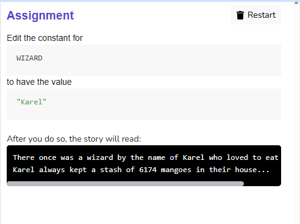

# Assignment 01 - Mad Libs

Edit the constant for WIZARD
to have the value "Karel"

After you do so, the story will read:

There once was a wizard by the name of Karel who loved to eat mangoes.
Karel always kept a stash of 6174 mangoes in their house...

