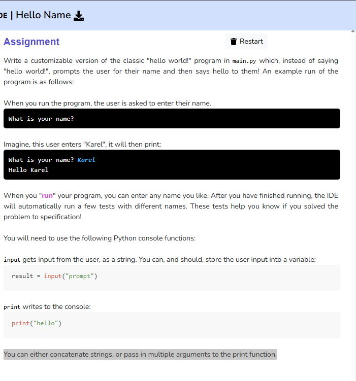

# Hello Name

Write a customizable version of the classic "hello world!" program in main.py which, instead of saying "hello world!", prompts the user for their name and then says hello to them! An example run of the program is as follows:

When you run the program, the user is asked to enter their name.

What is your name?

Imagine, this user enters "Karel", it will then print:

What is your name? Karel
Hello Karel

When you "run" your program, you can enter any name you like. After you have finished running, the IDE will automatically run a few tests with different names. These tests help you know if you solved the problem to specification!

You will need to use the following Python console functions:

input gets input from the user, as a string. You can, and should, store the user input into a variable:

result = input("prompt")

print writes to the console:

print("hello")

You can either concatenate strings, or pass in multiple arguments to the print function.

