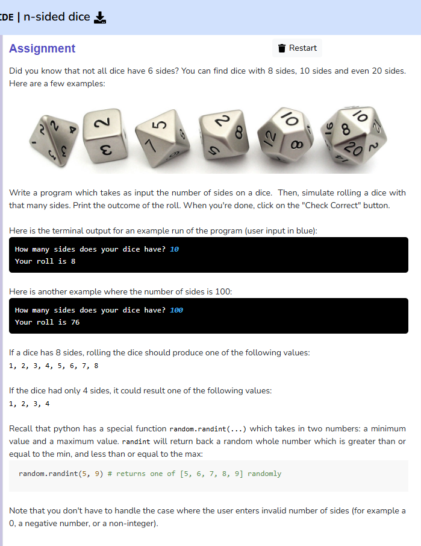

# n-sided dice

Did you know that not all dice have 6 sides? You can find dice with 8 sides, 10 sides and even 20 sides. Here are a few examples:

Write a program which takes as input the number of sides on a dice.  Then, simulate rolling a dice with that many sides. Print the outcome of the roll. When you're done, click on the "Check Correct" button.

Here is the terminal output for an example run of the program (user input in blue):

How many sides does your dice have? 10  
Your roll is 8

Here is another example where the number of sides is 100:

How many sides does your dice have? 100  
Your roll is 76 

If a dice has 8 sides, rolling the dice should produce one of the following values: 

1, 2, 3, 4, 5, 6, 7, 8

If the dice had only 4 sides, it could result one of the following values:

1, 2, 3, 4

Recall that python has a special function random.randint(...) which takes in two numbers: a minimum value and a maximum value. randint will return back a random whole number which is greater than or equal to the min, and less than or equal to the max:

random.randint(5, 9) # returns one of [5, 6, 7, 8, 9] randomly

Note that you don't have to handle the case where the user enters invalid number of sides (for example a 0, a negative number, or a non-integer).

