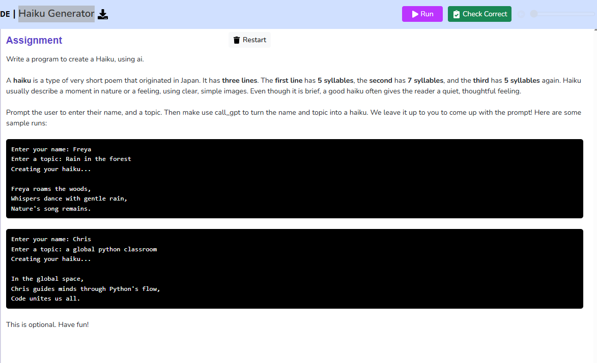

# Haiku Generator

Write a program to create a Haiku, using ai.

A haiku is a type of very short poem that originated in Japan. It has three lines. The first line has 5 syllables, the second has 7 syllables, and the third has 5 syllables again. Haiku usually describe a moment in nature or a feeling, using clear, simple images. Even though it is brief, a good haiku often gives the reader a quiet, thoughtful feeling.

Prompt the user to enter their name, and a topic. Then make use call_gpt to turn the name and topic into a haiku. We leave it up to you to come up with the prompt! Here are some sample runs:

Enter your name: Freya
Enter a topic: Rain in the forest
Creating your haiku...

Freya roams the woods,  
Whispers dance with gentle rain,  
Nature's song remains.

Enter your name: Chris
Enter a topic: a global python classroom
Creating your haiku...

In the global space,  
Chris guides minds through Python's flow,  
Code unites us all.

This is optional. Have fun!

