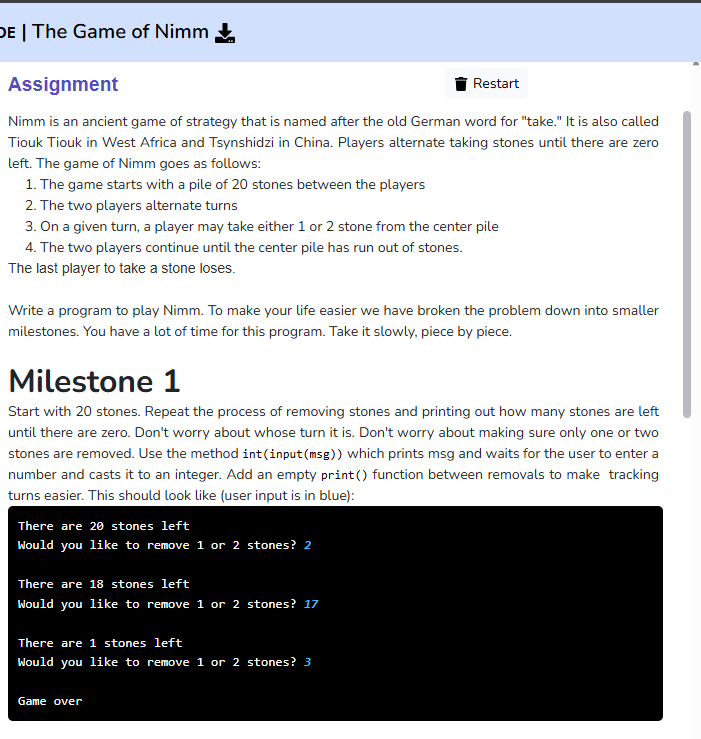
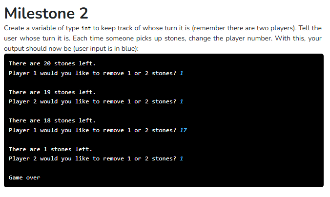
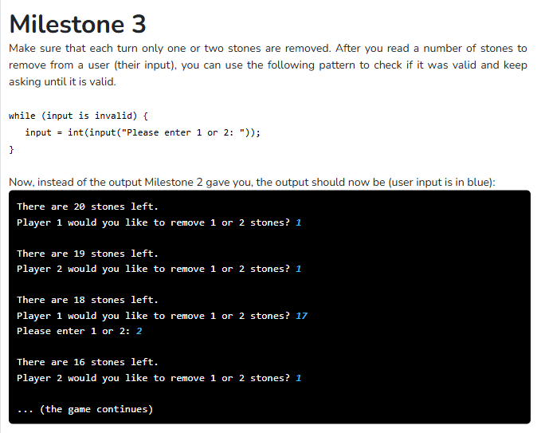
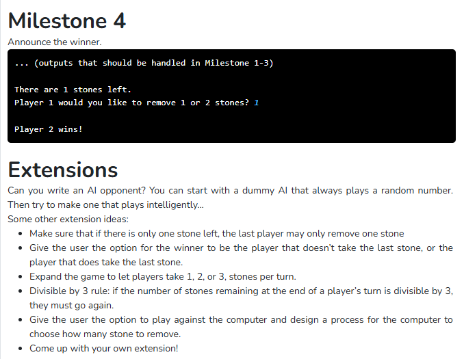

# Assignment 11 - The Game of Nimm
Nimm is an ancient game of strategy that is named after the old German word for "take." It is also called Tiouk Tiouk in West Africa and Tsynshidzi in China. Players alternate taking stones until there are zero left. The game of Nimm goes as follows:

The game starts with a pile of 20 stones between the players

The two players alternate turns

On a given turn, a player may take either 1 or 2 stone from the center pile

The two players continue until the center pile has run out of stones.

The last player to take a stone loses.

Write a program to play Nimm. To make your life easier we have broken the problem down into smaller milestones. You have a lot of time for this program. Take it slowly, piece by piece.

Milestone 1

Start with 20 stones. Repeat the process of removing stones and printing out how many stones are left until there are zero. Don't worry about whose turn it is. Don't worry about making sure only one or two stones are removed. Use the method int(input(msg)) which prints msg and waits for the user to enter a number and casts it to an integer. Add an empty print() function between removals to make  tracking turns easier. This should look like (user input is in blue):

There are 20 stones left
Would you like to remove 1 or 2 stones? 2

There are 18 stones left
Would you like to remove 1 or 2 stones? 17

There are 1 stones left
Would you like to remove 1 or 2 stones? 3

Game over

Milestone 2

Create a variable of type int to keep track of whose turn it is (remember there are two players). Tell the user whose turn it is. Each time someone picks up stones, change the player number. With this, your output should now be (user input is in blue):

There are 20 stones left.
Player 1 would you like to remove 1 or 2 stones? 1

There are 19 stones left.
Player 2 would you like to remove 1 or 2 stones? 1

There are 18 stones left.
Player 1 would you like to remove 1 or 2 stones? 17

There are 1 stones left.
Player 2 would you like to remove 1 or 2 stones? 1

Game over

Milestone 3

Make sure that each turn only one or two stones are removed. After you read a number of stones to remove from a user (their input), you can use the following pattern to check if it was valid and keep asking until it is valid.

while (input is invalid) {
   input = int(input("Please enter 1 or 2: "));
}

Now, instead of the output Milestone 2 gave you, the output should now be (user input is in blue):

There are 20 stones left.
Player 1 would you like to remove 1 or 2 stones? 1

There are 19 stones left.
Player 2 would you like to remove 1 or 2 stones? 1

There are 18 stones left.
Player 1 would you like to remove 1 or 2 stones? 17
Please enter 1 or 2: 2

There are 16 stones left.
Player 2 would you like to remove 1 or 2 stones? 1

... (the game continues)

Milestone 4

Announce the winner.

... (outputs that should be handled in Milestone 1-3)

There are 1 stones left.
Player 1 would you like to remove 1 or 2 stones? 1

Player 2 wins!

Extensions

Can you write an AI opponent? You can start with a dummy AI that always plays a random number. Then try to make one that plays intelligently...

Some other extension ideas:

Make sure that if there is only one stone left, the last player may only remove one stone

Give the user the option for the winner to be the player that doesn’t take the last stone, or the player that does take the last stone.

Expand the game to let players take 1, 2, or 3, stones per turn.

Divisible by 3 rule: if the number of stones remaining at the end of a player’s turn is divisible by 3, they must go again.

Give the user the option to play against the computer and design a process for the computer to choose how many stone to remove.

Come up with your own extension!

