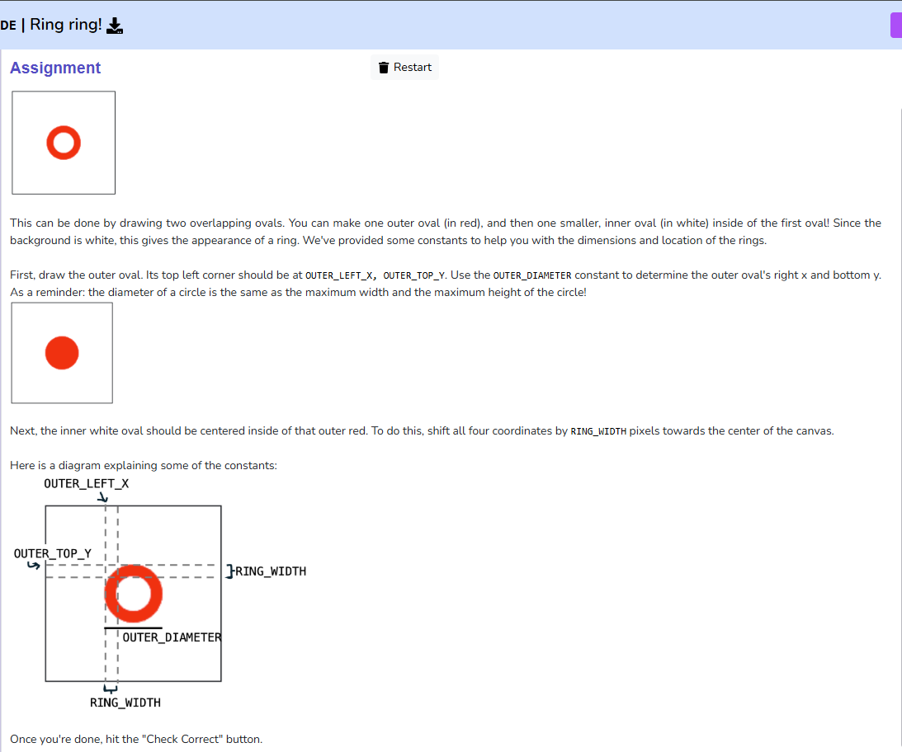

# Assignment 13 - Ring ring!
We can combine shapes to make new ones! To practice this, make a red ring, as shown below.

This can be done by drawing two overlapping ovals. You can make one outer oval (in red), and then one smaller, inner oval (in white) inside of the first oval! Since the background is white, this gives the appearance of a ring. We've provided some constants to help you with the dimensions and location of the rings. 

First, draw the outer oval. Its top left corner should be at OUTER_LEFT_X, OUTER_TOP_Y. Use the OUTER_DIAMETER constant to determine the outer oval's right x and bottom y. As a reminder: the diameter of a circle is the same as the maximum width and the maximum height of the circle!

Next, the inner white oval should be centered inside of that outer red. To do this, shift all four coordinates by RING_WIDTH pixels towards the center of the canvas.

Here is a diagram explaining some of the constants: 

Once you're done, hit the "Check Correct" button.

